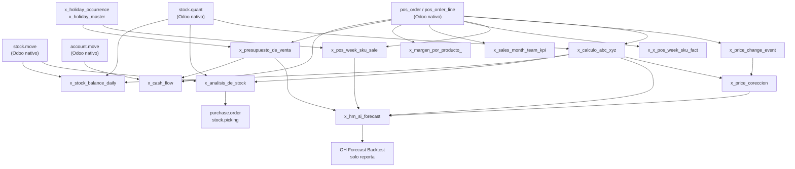

# Dependencies — OH Market

Mapa de qué lee y qué escribe cada script, y cómo se encadenan los modelos Studio.

---

## Tabla I/O por script

| Script | LEE | ESCRIBE |
|--------|-----|---------|
| **OH Calculo ABCXYZ** | product.product, product.category, stock.quant, stock.move.line, pos_order_line, sale.order_line | x_calculo_abc_xyz |
| **OH Cambio de Precio** | pos_order, pos_order_line, product_product, product_template, product_category | x_price_change_event |
| **OH Price Correccion** | x_price_change_event, x_loyalty_promo_event, x_calculo_abc_xyz, product.product, product.category | x_price_coreccion |
| **HM SI Forecast** | pos_order, pos_order_line, pos_config, product.*, x_price_change_event, x_price_coreccion, x_calculo_abc_xyz | x_hm_si_forecast |
| **OH Forecast Backtest** | x_hm_si_forecast, pos_order, pos_order_line | _(solo reporta)_ |
| **OH Analisis de Stock** | x_calculo_abc_xyz, stock.quant, stock.move, product.*, stock.warehouse, stock.location, stock.picking.type, pos.config | x_analisis_de_stock |
| **OH Generacion de Documentos** | x_analisis_de_stock, x_supply_generation, product.*, stock.warehouse, stock.location, stock.picking.type, purchase.order | purchase.order, stock.picking, x_supply_generation |
| **Stock Balance Daily** | stock.quant, stock.move, stock.warehouse, stock.location, pos.config, x_calculo_abc_xyz, product.product, product.category | x_stock_balance_daily |
| **OH Analisis Ventas SKU** | pos_order, pos_order_line, pos.session, pos.config, product.*, x_holiday_occurrence, x_holiday_master | x_pos_week_sku_sale |
| **OH Analisis ventas Categoria** | pos_order, pos_order_line, pos.session, pos.config, product.* | x_x_pos_week_sku_fact |
| **OH Analisis ventas Team** | pos_order, pos_order_line, pos.session, pos.config, product.* | x_sales_month_team_kpi |
| **OH Calculo de Margen** | pos_order_line, pos_order, sale.report, product.product, product.template, account.tax, product.category | x_margen_por_producto_ |
| **OH Presupuesto ventas** | sale.order, pos_order, pos.config, x_holiday_occurrence, x_holiday_master | x_presupuesto_de_venta |
| **OH Flujo de Caja** | pos_order, account.move, account.move_line, account.tax, x_presupuesto_de_venta, l10n_latam_document_type | x_cash_flow |

---

## Grafo de dependencias entre modelos Studio



---

## Modelos Odoo nativos compartidos

Qué scripts leen qué modelos nativos de Odoo (fuentes de verdad comunes).

### `pos_order` / `pos_order_line` / `pos.session` / `pos.config`

Fuente de verdad de venta retail. Leída por **9 de 14 scripts**.

| Script | Propósito de lectura |
|--------|---------------------|
| OH Calculo ABCXYZ | Demanda de referencia para ADI/CV² |
| OH Cambio de Precio | Detección de régimen de precio |
| HM SI Forecast | Historial semanal para SI y base de demanda |
| OH Analisis Ventas SKU | KPI semanal SKU |
| OH Analisis ventas Categoria | KPI semanal categoría |
| OH Analisis ventas Team | KPI mensual sucursal |
| OH Calculo de Margen | Venta neta y tickets |
| OH Presupuesto ventas | Histórico para factor rolling |
| OH Flujo de Caja | Venta real D → entrada caja D+1 |

**Detección dinámica de campo equipo:** `pos.config.crm_team_id` (v14+) o `pos.config.team_id` (v13).
**Detección dinámica de tipo producto:** `product.template.detailed_type` (v16+) o `product.template.type`.
**Detección combo:** `pos.order_line.combo_parent_id` (v16+).

---

### `stock.quant` / `stock.move`

Fuente de verdad de inventario.

| Script | Propósito de lectura |
|--------|---------------------|
| OH Calculo ABCXYZ | GMROI snapshot (stock.quant) + historial movimientos (stock.move.line) |
| OH Analisis de Stock | Stock actual por ubicación (stock.quant) |
| Stock Balance Daily | Roll-backward desde snapshot actual |

---

### `account.move` / `account.tax`

Fuente de verdad contable.

| Script | Propósito de lectura |
|--------|---------------------|
| OH Calculo de Margen | Impuestos IVA/ILA por producto (account.tax) |
| OH Flujo de Caja | Facturas compra pendientes/vencidas (account.move) + IVA operativo |

---

### `x_holiday_occurrence` / `x_holiday_master`

Modelos Studio de feriados. Leídos por OH Analisis Ventas SKU y OH Presupuesto ventas.
Detección dinámica: si no existen, ambos scripts aceptan override manual via contexto
`holiday_dates = ['YYYY-MM-DD', ...]`.

---

## Orden de ejecución del pipeline productivo

```
1. OH Calculo ABCXYZ          → x_calculo_abc_xyz
2. OH Cambio de Precio        → x_price_change_event
3. OH Price Correccion        → x_price_coreccion
4. HM SI Forecast             → x_hm_si_forecast
5. OH Analisis de Stock       → x_analisis_de_stock
6. OH Generacion de Documentos → purchase.order / stock.picking
```

**Paralelo / cron diario** (no bloquean el pipeline, pero deben correr frescos):
- `Stock Balance Daily` → x_stock_balance_daily
- `OH Presupuesto ventas` → x_presupuesto_de_venta
- `OH Flujo de Caja` → x_cash_flow (requiere presupuesto del mismo día)

**Analítica** (corren independiente, sin dependencia de forecast):
- `OH Analisis Ventas SKU`, `OH Analisis ventas Categoria`, `OH Analisis ventas Team`
- `OH Calculo de Margen`

**Validación post-pipeline:**
- `OH Forecast Backtest` (requiere x_hm_si_forecast + venta real POS)
